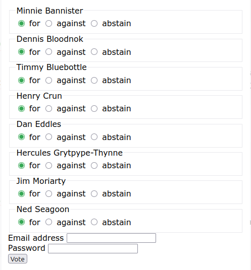

# Elector

An extremely simple tool to capture electoral votes for AGMs (in particular).
This was written in a hurry to address a simple but (apparently) unmet need.

### Installation

The notes below assume Debian or one of its derivatives.

It is assume that this script will be installed on a remote server but managed
from a local device over SSH. No fancy web interfaces or other fluff here.

On your server, choose a location in which to install this script. For
convenience, it is assumed here that a new user **elector** has been created
and that The administrator's SSH public key has been added to

    /home/elector/.ssh/authorized_keys

Create a directory to hold the data:

    sudo mkdir /var/elector/
    sudo chown -R elector:elector /var/elector

Download the script:

    git clone https://github.com/jethro-swan/Elector
    cd /home/elector/Elector

Make sure that the two command-line scripts are executable and somewhere
convenient:

    chmod g+x initialize.py
    chmod g+x fetch_results.py
    sudo cp initialize.py /usr/local/bin/
    sudo cp fetch_results.py /usr/local/bin/

Create a virtual environment and install the required Python libraries:

    python3 -m venv venv
    source venv/bin/activate
    pip install flask
    pip install gunicorn
    deactivate

(There may be other dependencies to import. If so, these will become obvious.)

In your DNS configuration, create a subdomain pointing to your server, e.g.

    agm.someimaginary.org

Create a virtual host and reverse proxy (this example uses Apache2)

    cd /etc/apache2/sites-available/
    sudo vi agm.someimaginary.org.conf

containing

    <Virtualhost *:80>
    ServerName agm.someimaginary.org.conf
    ProxyPreserveHost On
    ProxyPass / http://localhost:8000/
    ProxyPassReverse / http://localhost:8000/
    </Virtualhost>

then enable this

    sudo a2ensite agm.someimaginary.org.conf
    sudo systemctl reload apache2

and create an SSL certificate

    sudo certbot --apache -d agm.someimaginary.org.conf

### Initializing

Create a list of election candidates **candidates.txt** such as:

  > Minnie Bannister\
  > Dennis Bloodnok\
  > Timmy Bluebottle\
  > Henry Crun\
  > Dan Eccles\
  > Hercules Grytpype-Thynne\
  > Jim Moriarty\
  > Ned Seagoon

NB, the order in which they are listed here is the order in which they will
appear in the voting screen.

Upload this:

    me@myworkstation:~$ scp candidates.txt elector@whereverthehostis:/var/elector/

Create a list of eligible voters' email addresses in **members.txt**, e.g.

  > d.bloodnok@hm3rdexploders.gov.uk\
  > bluebottle@finchleyscouts1956.goons.org\
  > henry.crun@whacklowfuttleandcrun.co.uk\
  > moriarty@reichenbach.de

Upload this:

    me@myworkstation:~$ scp members.txt elector@whereverthehostis:/var/elector/

Run the Initialization script to create the database:

    me@myworkstation:~$ elector_

### Starting/stopping

    /home/elector/Elector/venv/bin/gunicorn -w 4 --bind 0.0.0.0:8000 elector:app &

You should probably create a simple alias such as _run_elector_ for that. this
will) be far more convenient when starting it over SSH, e.g.

    me@myworkstation:~$ ssh elector@whereverthehostis run_elector

To stop it, simply bring to the foreground with _fg_ and press _ctrl-C_.

### voting

This tool was designed to meet the simple needs of AGM, although it can easily
be used for other purposes. The expectation is that the link to the form will
sent to all registered members (those whose email addresses are listed in they
**members.txt** file). Using the examples above, the screen looks like this (so
can obviously be embedded conveniently in an iFrame or view on a phone screen).

By default, "for" is selected. If the  email address is not recognized, no
vote will be recorded. In this simple initial version, all members are assigned
the same password. (Although it would be very simple to extend this to give
each a unique password, that would complicate usage and is not obviously worth
the trouble at this stage.)

If the email address is recognized and the password is correct, the vote will
be recorded. The voter may return to the form a few times (the default number
is four) to revise the vote.

### Fetching the fetch_results

To fetch the results of the vote, run

    me@myworkstation:~$ ssh elector@whereverthehostis > results.csv

to produce a simple CSV file.

### Tweaking

The values in

    app/core/constants.py
    app/static/css/default.css

can easily be modified. In particular, the **shared password must be changed**.
